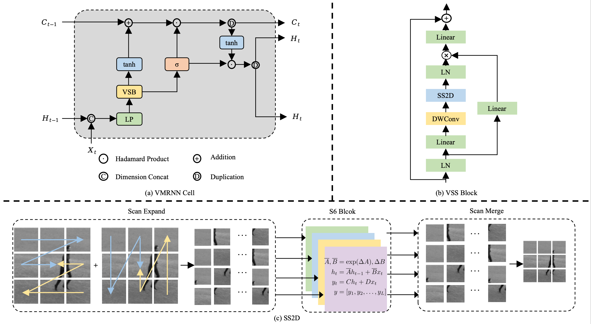

# VMRNN: Integrating Vision Mamba and LSTM for Efficient and Accurate Spatiotemporal Forecasting

Official repository for VMRNN: Integrating Vision Mamba and LSTM for Efficient and Accurate Spatiotemporal Forecasting. 

## Overview

We propose the VMRNN cell, a new recurrent unit that integrates the strengths of Vision Mamba blocks with LSTM. Our extensive evaluations show that our proposed approach secures competitive results on a variety of pivot benchmarks while maintaining a smaller model size.




## Introduction

Combining CNNs or ViTs, with RNNs for spatiotemporal forecasting, has yielded unparalleled results in predicting temporal and spatial dynamics. However, modeling extensive global information remains a formidable challenge; CNNs are limited by their narrow receptive fields, and ViTs struggle with the intensive computational demands of their attention mechanisms. The emergence of recent Mamba-based architectures has been met with enthusiasm for their exceptional long-sequence modeling capabilities, surpassing established vision models in efficiency, accuracy, and computational footprint, which motivates us to develop an innovative architecture tailored for spatiotemporal forecasting. In this paper, we propose the VMRNN cell, a new recurrent unit that integrates the strengths of Vision Mamba blocks with LSTM. We construct a network centered on VMRNN cells to tackle spatiotemporal prediction tasks effectively. Our extensive evaluations show that our proposed approach secures competitive results on a variety of pivot benchmarks while maintaining a smaller model size.


## Installation

```
conda env create -f environment.yml
conda activate VMRNN
pip install -e .
pip install einops
pip install torch==1.13.0 torchvision==0.14.0 torchaudio==0.13.0 --extra-index-url https://download.pytorch.org/whl/cu117
pip install packaging timm==0.4.12 pytest chardet yacs termcolor submitit tensorboardX triton==2.0.0 fvcore
pip install causal_conv1d==1.0.0
pip install mamba_ssm==1.0.1
```


## Overview
- `data/:` contains KTH/TaxiBJ dataset. Download (tools/prepare_data).
- `openstl/methods/VMRNN.py:` contains defined training method of VMRNN_D and VMRNN-B.
- `openstl/models/VMRNN_model.py:` contains the model VMRNN-D and VMRNN-B.
- `scripts:` contains ddp and single GPU training scripts for KTH/TaxiBJ.
- `configs` contains training configs for KTH/TaxiBJ/Moving MNIST.
- `Moving_MNIST_VMRNN:` contains the code base for Moving MNIST.
- `Moving_MNIST_VMRNN/data:` contains Moving MNIST dataset: train-images-idx3-ubyte.gz and mnist_test_seq.npy. Download (tools/prepare_data).


## Train

### TaxiBJ

```
bash scripts/taxibj/single/taxibj_mamba_1gpu.sh # single gpu
bash scripts/taxibj/ddp/taxibj_mamba_4gpu.sh # ddp
```

### KTH

```
bash scripts/kth/single/kth_mamba.sh # single gpu
bash scripts/kth/ddp/kth_mamba_2gpu.sh # ddp
```

### Moving MNIST

```
cd Moving_MNIST_VMRNN
bash scripts/mm/train_mm_mamba.sh # train 
bash scripts/mm/test_mm_mamba.sh # test our pretrained model
```
